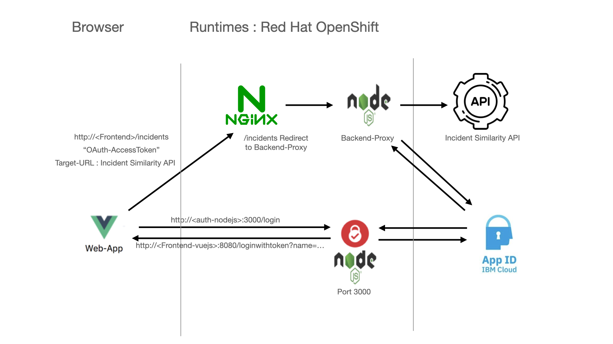

# aiops-app

## Introduction

The AIOps application provides a frontend for the IBM AIOps incident similarity API.
It's written in VUEJs and consist of multiple components to make is secure.

## Architecture :



## Components Overview

### VueJs Frontend application: [https://github.com/yvesdebeer/aiops-app](https://github.com/yvesdebeer/aiops-app)

The build version of this application uses an NGINX proxy to serve the compiled code from VueJS.
Once the client has been authenticated, they get access to the main search form to query the incident similarity information exposed by the AIOps api.
A search query will first get a list of similar incidents through the "Incident Similarity API" and then for each incident, a description field will be searched by calling an Elastic Search API.
In order to make this happen, the VueJS application has two routes: "./incidents" and "./description". The NGINX proxy contains redirect information and will route both paths to the "NodeJS Backend Proxy"

```
location /incidents {
       proxy_pass http://node-backend-proxy:3333/api/incidents;
   }
   location /description {
       proxy_pass http://node-backend-proxy:3333/api/description;
   }
```

#### Deployment : 

The application uses a .env file when running locally so you will need to set these variables as part of a BuildConfig when deploying to e.g. Red Hat OpenShift.
These variables will define the communication targets for authentication and for both "incidents" and "description" api's.

```
# cat .env
VUE_APP_AUTH_URL="http://localhost:3000/login"
VUE_APP_INCIDENTS_URL="./incidents"
VUE_APP_DESCRIPTION_URL="./description?"
VUE_APP_INCIDENTS_TARGETURL="https://<aimanager-internal-url>/v2/similar_incidents/search"
VUE_APP_DESCRIPTION_TARGETURL="https://<elastic-search-internal-url>/_search?q="
VUE_APP_PROXY_PASS_URL="http://<node-backend-proxy-internal-url>/api"
```

### IBM AppID Security Service

Create a new "App ID" service instance in IBM Cloud.

Open the newly created Service instance:

- Add a new application
- Give it a name.
- Use "regularwebapp" as application type

When you click on the newly created app you should see a JSON structure with all info such as : clientId, tenantId and oAuthServerURL. Take note as you will need these values in the next step !

### NodeJS Authentication: [https://github.com/yvesdebeer/authentication-nodejs](https://github.com/yvesdebeer/authentication-nodejs)

This NodeJS application will act as an intermediate program to handle the client OAuth authentication with the IBM AppID Security Service. Once the client has been authenticated, the application will get an "IdToken" as well as an "accessToken" which will be stored on the client side (VueJS State).

The application also uses a .env file which contains the parameters to communicate with the IBM AppID Security Service. You will need to set these variables as part of a BuildConfig when deploying to e.g. Red Hat OpenShift.

```
# cat .env
APPID_OAUTHSERVERURL=https://eu-de.appid.cloud.ibm.com/oauth/v4/xxxxxxxx-xxxx-xxxx-xxxx-xxxxxxxxxxxx
APPID_CLIENTID=xxxxxxxx-xxxx-xxxx-xxxx-xxxxxxxxxxxx
APPID_SECRET=xxxxxxxx
REDIRECT_URL_CALLBACK=http://<VueJS-application-URL>/callback
REDIRECT_URL_WEB_APP=http://<VueJS-application-URL>/loginwithtoken
```

### NodeJS Backend-Proxy: [https://github.com/yvesdebeer/node-backend-proxy](https://github.com/yvesdebeer/node-backend-proxy)

This NodeJS application acts as a proxy between the frontend application and the internal AIOps api's.

This proxy has two functions:

1. Secure all incoming call's with OAuth - every client request should contain a valid "Bearer AccessToken" which will be validated through IBM AppID Security Service.
2. Forward the incoming request to the final API - the target will be defined by the HTTP header "Target-URL" which is sent by the client.

The application uses a .env file which contains the parameters to communicate with the IBM AppID Security Service. You will need to set these variables as part of a BuildConfig when deploying to e.g. Red Hat OpenShift.

```
# cat .env
APPID_OAUTHSERVERURL=https://eu-de.appid.cloud.ibm.com/oauth/v4/xxxxxxxx-xxxx-xxxx-xxxx-xxxxxxxxxxxx
```